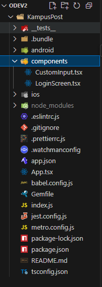
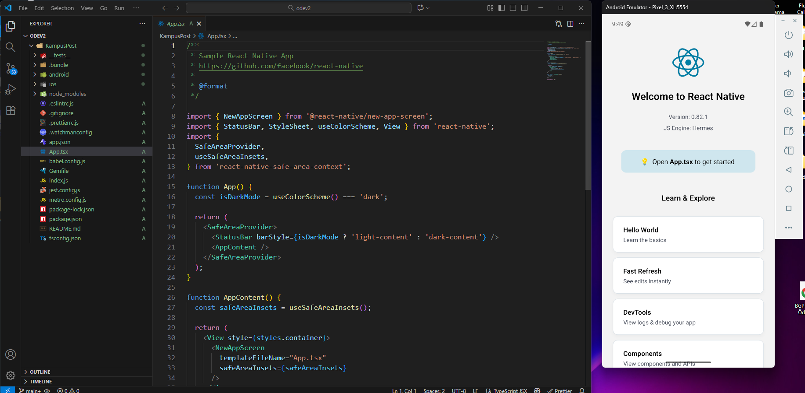
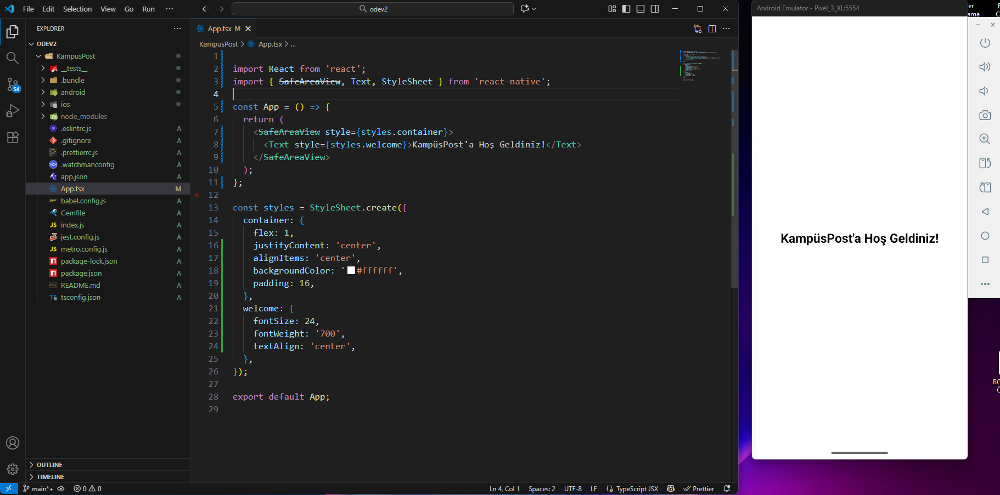
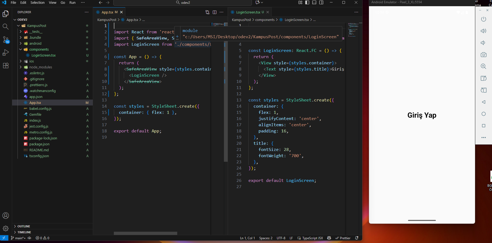
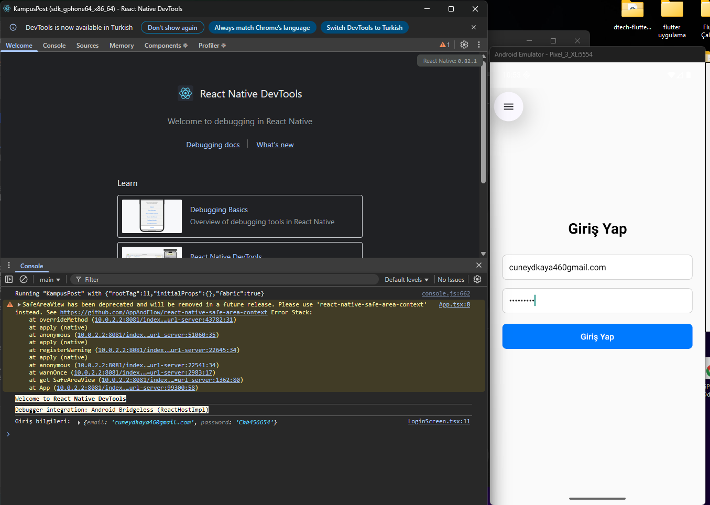

# KampusPost (React Native Ödev 2)

## Proje Klasör Yapısı

## Uygulama Görünümü

Uygulama çalıştırıldığında ekranda e-posta ve şifre giriş alanları ile “Giriş Yap” butonu görünür.

## Konsol Çıktısı

Giriş yap butonuna basıldığında Metro konsolunda e-posta ve şifre bilgileri yazdırılır.

